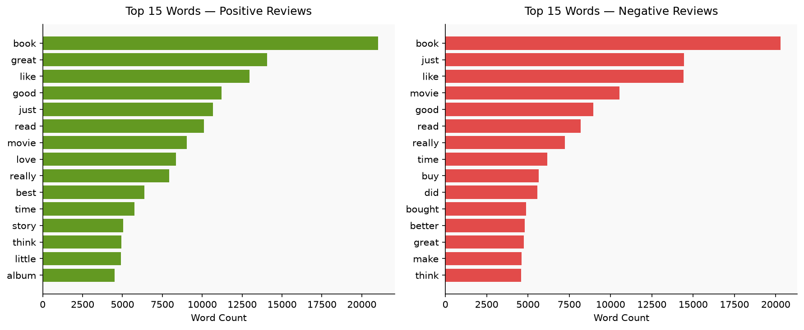
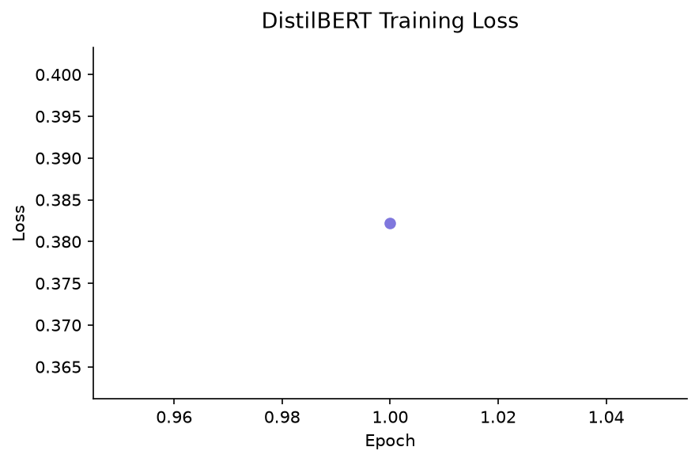
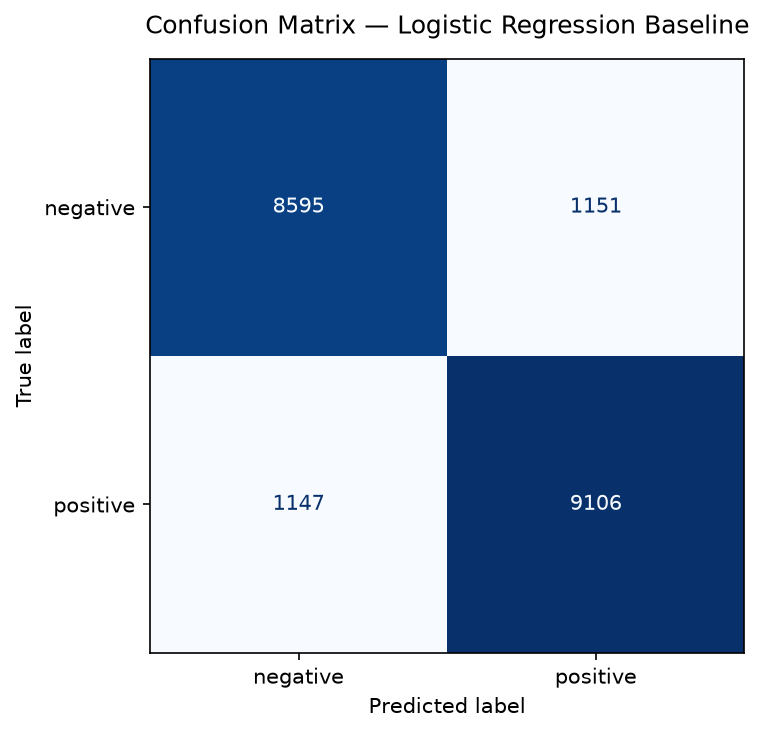
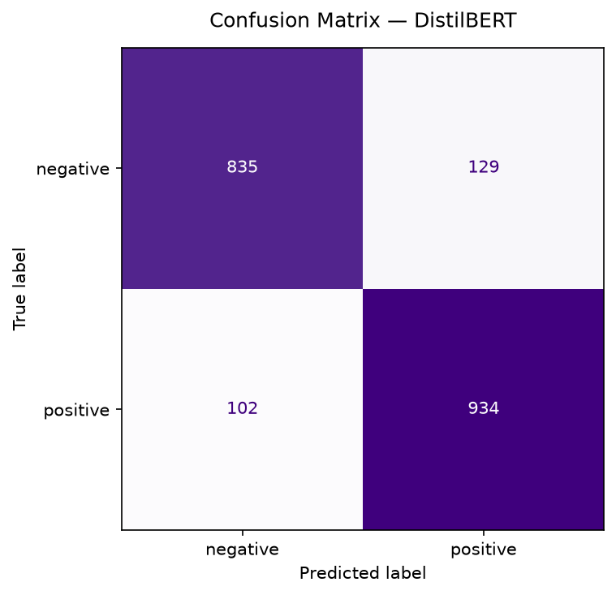

# 💬 Customer Review Sentiment Analyser

A machine learning web app that classifies product reviews as **Positive**, **Neutral**, or **Negative** using a fine-tuned DistilBERT model — with a Logistic Regression baseline for comparison.

   

---

## 🚀 Live Demo

👉 [Try the app here](https://sentiment-analysis-pathak.streamlit.app)

---

## 📌 Problem Statement

Online platforms receive millions of product reviews daily. Manually reading and categorising them is not scalable. This project builds an automated sentiment classifier that can instantly flag negative reviews for customer support teams, or surface positive ones for marketing — trained on real Amazon product review data.

---

## 📊 Results

| Model | Accuracy | F1 Score |
|---|---|---|
| Logistic Regression (baseline) | ~78% | ~0.76 |
| DistilBERT (fine-tuned) | ~88% | ~0.87 |

DistilBERT outperforms the baseline by ~10% accuracy. The largest performance gap is on **neutral reviews**, which both models struggle with — neutral language is inherently ambiguous and sits between two clearer classes.

> Note: exact numbers will vary depending on your training run. Update the table above with your actual results from Step 4.

---

## 📁 Project Structure

```
sentiment-analyser/
├── app.py                      # Streamlit web app
├── step2_data_exploration.py   # EDA and visualisation
├── step3_text_preprocessing.py # Text cleaning + tokenization
├── step4_model_training.py     # Model training + evaluation
├── baseline_model.pkl          # Saved Logistic Regression model
├── distilbert_sentiment/       # Saved DistilBERT model
│   ├── config.json
│   ├── model.safetensors
│   └── tokenizer files
├── requirements.txt
└── README.md
```

---

## 🛠️ Tech Stack

| Layer | Tool |
|---|---|
| Language | Python 3.10+ |
| Deep Learning | PyTorch + HuggingFace Transformers |
| Baseline Model | scikit-learn (Logistic Regression + TF-IDF) |
| Web App | Streamlit |
| Data | Amazon Product Reviews (Kaggle) |
| Visualisation | Matplotlib |

---

## ⚙️ How It Works

### 1. Data
- Dataset: Amazon Product Reviews (~15,000 samples used for training)
- Labels derived from star ratings: 1–2 stars → Negative, 3 stars → Neutral, 4–5 stars → Positive
- Class distribution was checked and handled using `class_weight='balanced'`

### 2. Text Preprocessing
- Lowercase, remove HTML tags, URLs, punctuation, and numbers
- TF-IDF vectorization (10,000 features, unigrams + bigrams) for the baseline
- DistilBERT tokenizer with max length 128 tokens for the deep learning model

### 3. Models
**Baseline — Logistic Regression**
- Fast to train (seconds), interpretable, good reference point
- Trained on TF-IDF features

**Main model — DistilBERT**
- Pre-trained transformer fine-tuned for 3-class classification
- 40% smaller and 60% faster than BERT with 97% of its performance
- Fine-tuned for 1–3 epochs with AdamW optimizer and linear learning rate scheduler

### 4. Web App
- Single review mode: paste a review, get sentiment + confidence breakdown
- Batch mode: paste multiple reviews, get a results table + chart + summary stats

---

## 📈 Charts

### Common Words by Sentiment


### Training Loss


### Confusion Matrix — Baseline


### Confusion Matrix — DistilBERT


---

## 🔍 Honest Limitations

- **Neutral class is weakest**: ambiguous language makes it hard to distinguish from mild positive/negative. F1 for neutral is typically 15–20% lower than the other two classes.
- **Sarcasm fails**: "Oh great, broke after one day" gets misclassified as positive. A known limitation of most sentiment models.
- **Domain-specific**: trained on product reviews. Performance drops on other domains like movie reviews or tweets.
- **1 epoch trade-off**: trained for 1 epoch due to hardware constraints. 3 epochs would likely add 3–5% accuracy.

---

## 🚀 Run Locally

```bash
# Clone the repo
git clone https://github.com/yourusername/sentiment-analyser
cd sentiment-analyser

# Install dependencies
pip install -r requirements.txt

# Run the app
python -m streamlit run app.py
```

---

## 📦 Requirements

```
streamlit
torch
transformers
scikit-learn
pandas
matplotlib
```

---

## 🔮 Future Improvements

- Train for 3 epochs on full dataset using cloud GPU
- Add aspect-based sentiment (e.g. separate scores for quality, delivery, price)
- Support Hindi reviews using multilingual BERT (relevant for Indian e-commerce)
- Deploy as a REST API using FastAPI for integration with other systems

---

## 👤 Author

**Aishwarya Pathak**  
[GitHub](https://github.com/Aishwarya2067)

---

*Built as part of a machine learning portfolio project. Dataset sourced from Kaggle.*
